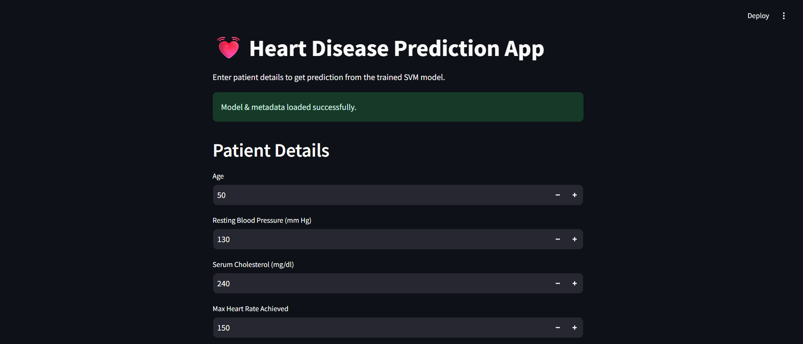
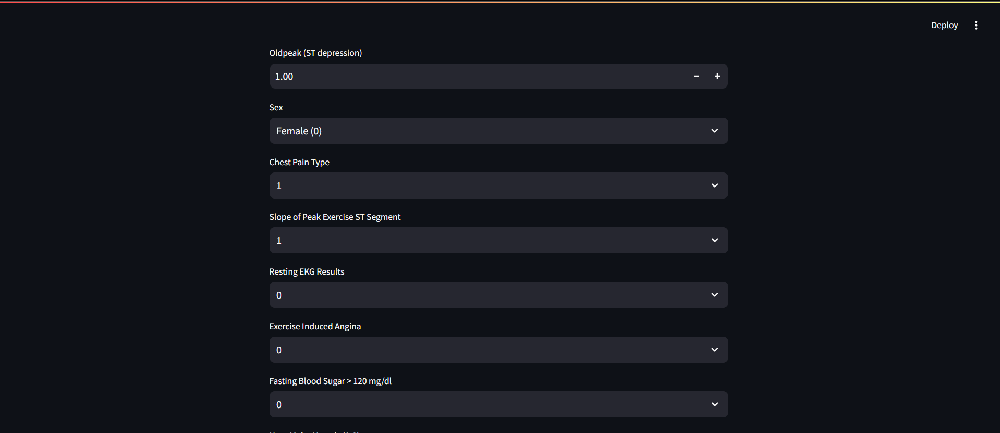
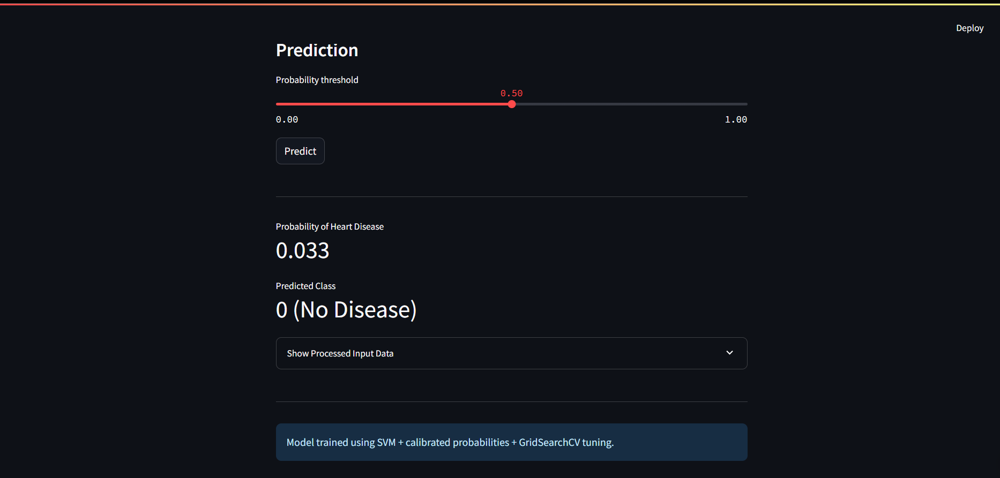

🫀 Heart Disease Prediction System
Machine Learning · SVM Classifier · Calibration · Streamlit Web App

This project predicts the probability of heart disease in patients using a Calibrated SVM model wrapped inside a clean end-to-end ML pipeline (preprocessing → model → probability calibration).
A Streamlit web application provides an interactive UI for real-time predictions.
A batch scoring script handles CSV predictions for multiple patients at once.

📌 Features:
✔️ End-to-End ML pipeline

Preprocessing (scaling + encoding)
SVM classifier with hyperparameter tuning
Probability calibration using CalibratedClassifierCV (cv='prefit')

✔️ Interactive Streamlit Web Application

Real-time predictions
Adjustable probability threshold slider
Displays probability, predicted class, and processed feature vector
User-friendly UI for non-technical stakeholders

✔️ Batch Prediction Support

Use batch_predict.py to score multiple rows from a CSV.

✔️ Clean, Deployment-Ready Structure

final_calibrated_model.joblib
model_meta.joblib
requirements.txt, README.md, and sample test files

## 🔥 Application Preview

### Home Screen

### Patient Input Form

🧪 Sample Inputs for Testing:

### Sample Prediction Output

### Threshold Slider Feature

📂 Project Structure:
DataScience_projects/
│
├── app.py # Streamlit web application
├── batch_predict.py # Batch prediction script for CSV files
├── final_calibrated_model.joblib # Final ML model (preprocessed + calibrated)
├── model_meta.joblib # Training metadata (cols, dtypes, threshold)
├── heart_dp.ipynb # Full notebook: EDA, training, calibration
├── requirements.txt # Python dependencies
├── README.md # Project documentation
│
├── test_input.csv # Sample input for batch predictions
└── test_output.csv # Sample model output

🚀 How to Run Locally:
1️⃣ Create & activate a virtual environment
python -m venv venv
source venv/bin/activate # Windows: venv\Scripts\activate

2️⃣ Install dependencies
pip install -r requirements.txt

3️⃣ Run the Streamlit app
streamlit run app.py

Now open → http://localhost:8501

📊 Model Overview:

Algorithm: Support Vector Machine (SVC)
Hyperparameter tuning: GridSearchCV / RandomizedSearchCV
Probability calibration: Sigmoid method using CalibratedClassifierCV
Why calibration?
SVM decision function outputs are not true probabilities. Calibration ensures outputs reflect real risk levels.

🧪 Sample Inputs for Testing:

Below are example test cases you can enter into the UI to validate predictions.

🟢 No Disease (Low risk)

ND1: Probability ≈ 0.164
ND2: Probability ≈ 0.156
ND3: Probability ≈ 0.047

🔴 Disease Likely (High risk)

D1: Probability ≈ 0.953
D2: Probability ≈ 0.842

Example UI output:

Probability of Heart Disease: 0.944
Predicted Class: 1 (Disease)

📦 Batch Prediction Usage:

Prepare a CSV like:

age,resting_blood_pressure,serum_cholesterol_mg_per_dl,...
62,147,290,...
55,140,260,...

Run batch prediction:

python batch_predict.py input.csv output.csv

Output will contain:

probability score
predicted class
processed features

🌐 Deployment

1. To deploy on Streamlit Cloud:
2. Push this project to GitHub
3. Visit https://share.streamlit.io
4. Choose New App → Connect GitHub Repo
5. Select branch main and file app.py
6. Deploy

📘 Files for Submission

For academic submission, include:

heart_dp.ipynb + PDF export
app.py
batch_predict.py
final_calibrated_model.joblib
model_meta.joblib
This README.md

📚 Technologies Used

Python
Scikit-Learn
Pandas / NumPy
Streamlit
Matplotlib / Seaborn
Joblib

👨‍💻 Author

K B Anishraj
ML Enthusiast
Email: anishraj.klb@gmail.com

⭐ If you like this project and want more ML apps—star the repo!
